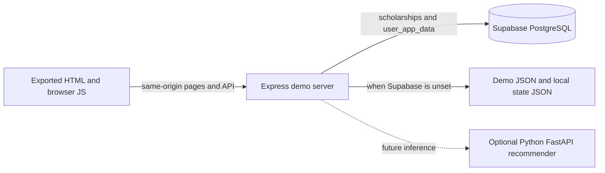

# ScholarMatched

ScholarMatched helps students discover scholarship opportunities, organize application work, and keep their profile and preparation materials together. This repository contains a downloaded static website, a runnable Node.js demo backend, fictional seed data, and a Supabase schema/import path.

> **Implementation status:** The demo experience runs locally. Its sign-in is a single shared demo account, its five scholarship records are fictional, and it does not perform AI matching or model training. Do not deploy the demo credentials or represent demo recommendations/data as real. Production authentication, operational data, and any trained model require the work described below.

## Contents

- [Technology stack](#technology-stack)
- [Current architecture](#current-architecture)
- [Build and run](#build-and-run)
- [Demo access](#demo-access)
- [Supabase and data](#supabase-and-data)
- [Requirements specification](#requirements-specification)
- [API contract](#api-contract)
- [Scholarship recommender and model training](#scholarship-recommender-and-model-training)
- [Node.js and FastAPI options](#nodejs-and-fastapi-options)
- [Security, privacy, and operations](#security-privacy-and-operations)
- [Testing and acceptance](#testing-and-acceptance)
- [Roadmap](#roadmap)
- [Next.js frontend and FastAPI backend migration](#nextjs-frontend-and-fastapi-backend-migration)

## Technology stack

| Layer | Current implementation | Production direction |
| --- | --- | --- |
| Frontend | Exported HTML/CSS and browser JavaScript; prebuilt Next.js/Turbopack chunks remain under `_next/`. | Recover/rebuild maintainable frontend source, add a frontend build and accessibility/component tests. The source project is not present in this export. |
| Web/API server | Node.js (tested with Node 22) and Express 5, serving both the export and JSON APIs. | Keep Node.js as the main application API unless the product team has a strong Python-only requirement. |
| Browser session | HMAC-signed, HTTP-only demo cookie. | Replace demo login with Supabase Auth or another maintained identity provider; use per-user authorization. |
| Relational data | Supabase PostgreSQL when configured; local JSON fallback for demo scholarship/state data. | Supabase PostgreSQL with migrations, backups, authorization policies, and real curated records. |
| Supabase integration | `@supabase/supabase-js` server client with service-role key kept in backend environment. | Use server-only credentials and least-privilege access. Never bundle a service-role/secret key into frontend files. |
| Imports | `csv-parse` plus validated CSV/JSON import endpoint and CLI. | Staff-only, audited imports with source, verification, expiry, and correction workflows. |
| Model/recommendations | No trained model or AI inference service is currently implemented. | Start with explicit eligibility rules and a transparent content-based score; add a Python/FastAPI model service only when labeled data and measured benefit justify it. |
| Tests | Node built-in test runner (`node:test`) for importer and HTTP demo flows. | Add frontend end-to-end, accessibility, migration, security, and model evaluation tests. |

The root directory is the site document root. `backend/` contains the Node application. The HTML files are export artifacts, not the original React/Next.js source; edit the existing HTML/JS directly for this demo or restore a real source project before planning larger frontend feature work.

## Current architecture



The server injects `auth-client.js` into HTML responses, redirects protected pages to `login.html`, and stores the signed demo session in an HTTP-only cookie. Page state is synchronized through `/api/data`. When Supabase is not configured, sample catalog data comes from `backend/data/demo-data.json` and changes are written to `backend/data/demo-state.json` (ignored by Git). When Supabase is configured, catalog and per-user page-state persistence use PostgreSQL.

The shipped HTML routes include the landing page, demo login, dashboard, scholarship browser, profile/onboarding, tracker, checklist, notifications, templates, advisor, SOP reviewer, visa/travel, referrals, help, and informational pages. Feature depth differs by page; a page being present does not imply a production-ready workflow or an implemented AI service.

## Build and run

### Requirements

- Node.js 22 LTS recommended (Node 18 or newer is required by the selected dependencies).
- npm 10 or newer recommended.
- Supabase project only if data should persist outside the local demo JSON files.

### Local development

Run commands from the repository root:

```sh
cd backend
npm ci
npm test
npm start
```

Open <http://localhost:3001/>. The server redirects `/` to `/index.html`. `npm run dev` restarts the server when backend files change. The backend serves the static site from the parent directory; do not run a second static server for the same local demo session.

### Environment variables

Copy `backend/.env.example` to `backend/.env` and set values as needed:

| Variable | Required | Purpose |
| --- | --- | --- |
| `PORT` | No | HTTP port; defaults to `3001`. Production hosts commonly supply this. |
| `SUPABASE_URL` | For Supabase persistence | Supabase project URL. |
| `SUPABASE_SERVICE_ROLE_KEY` | For Supabase persistence | Server-only service-role/secret key. Never expose it to a browser. |
| `ADMIN_API_KEY` | For HTTP imports | Private token required by the scholarship import endpoint. |
| `SESSION_SECRET` | Production | Long, random secret used to sign the demo session cookie. |
| `DEMO_EMAIL` | No for local demo; required in production mode | Demo-account email override. |
| `DEMO_PASSWORD` | No for local demo; required in production mode | Demo-account password override. |
| `DEMO_STATE_FILE` | No | Optional path for local demo state JSON. |
| `FRONTEND_ORIGINS` | No | Comma-separated allowed origins for cross-origin API use. Same-origin hosting is preferred for cookie sessions. |
| `NODE_ENV` | No | Set to `production` in a production deployment; enables startup checks and secure cookies. |

Do not commit `.env`, private tokens, real student records, or user-uploaded application documents.

## Demo access

- Email: `student@scholarmatched.test`
- Password: `ScholarDemo2026!`

These public, fixed credentials are for local demonstration only. Anyone who knows them can access the shared demo account. Do not deploy them, put real personal information in the demo, or use this login as a production identity system. Production mode requires explicit `DEMO_EMAIL`, `DEMO_PASSWORD`, and `SESSION_SECRET`; this is a startup guard, not a replacement for production authentication.

## Supabase and data

### Initial setup

1. Create/select the Supabase project that should hold this app's data.
2. Open Supabase **SQL Editor** and run [`backend/supabase/schema.sql`](backend/supabase/schema.sql).
3. Copy the project URL and server-only service-role/secret key into `backend/.env`.
4. Set a random `ADMIN_API_KEY` and `SESSION_SECRET`; restart the backend.
5. Check `GET /api/health` and confirm `supabaseConfigured` is `true`.
6. Import verified scholarship records using the CSV steps below.

The downloaded frontend bundle also contains its own public Supabase URL/key. A newly selected Supabase project may require updating that frontend configuration for any remaining direct browser calls. The backend service-role key must never be added to that bundle.

### Tables in the current migration

**`public.scholarships`** stores the catalog: UUID `scholarship_id`, required `scholarship_name`, provider, description, location, eligibility countries, degree, field, funding type, amount/currency, deadline, URLs, status, and creation timestamp. The migration enables row-level security and allows anonymous/authenticated clients to select active scholarships. The backend uses its service credential for writes.

**`public.user_app_data`** stores a JSONB object and `updated_at` per `user_id`. Direct browser access is revoked; the server reads/writes it. In the demo, the ID is `demo-student`. Before real multi-user use, replace demo auth, bind each record to a verified auth identity, and enforce owner-level access on every request. Do not treat a client-submitted user ID as authorization.

### Scholarship data upload

Use [`backend/data/scholarships.template.csv`](backend/data/scholarships.template.csv). `scholarship_name` is required. Dates use `YYYY-MM-DD`; separate `eligible_countries` with semicolons; statuses are `active`, `inactive`, or `expired`. Imports accept up to 500 rows, validate columns/values, and update supplied fields on existing records.

CLI import (preferred for private or large datasets):

```sh
cd backend
npm run import -- ./data/scholarships.csv
```

The admin API accepts raw CSV or a JSON array at `POST /api/admin/scholarships/import` with an `x-admin-token` header. Do not call this endpoint from browser JavaScript or distribute the admin token. Use the CLI if possible; if using the endpoint, send it only from a trusted admin environment.

```sh
curl -X POST http://localhost:3001/api/admin/scholarships/import \
  -H 'content-type: text/csv' \
  -H 'x-admin-token: YOUR_ADMIN_API_KEY' \
  --data-binary @./data/scholarships.csv
```

Only import opportunities whose source, eligibility, deadline, award, and application URL have been checked. Keep a source URL and verification timestamp in the operational data process even though those audit columns are not yet in the current table schema.

## Requirements specification

This is an initial, implementation-oriented SRS for the demo and its production direction. It is not a claim that every requirement is already delivered.

### 1. Purpose and scope

The system should help prospective international students find relevant, current scholarships and organize their application preparation. The web application consists of a public information/catalog experience, an authenticated student workspace, a scholarship data-management path for trusted staff, and (as a future optional service) a recommendation model.

**In scope:** scholarship catalog/search, student profile and preferences, saved opportunities, application tracking, checklists/resources, notifications, and explainable eligibility/matching. **Out of scope for the current demo:** real account registration/reset/MFA, payments, document review by a real AI model, authoritative immigration/legal advice, institution system integrations, and model training/inference.

### 2. Actors

- **Visitor:** reads public informational pages and browses opportunities that the product chooses to expose publicly.
- **Student:** maintains study preferences/profile, saves scholarships, tracks applications, and uses preparation resources.
- **Scholarship curator/admin:** imports and verifies catalog entries, fixes errors, and retires expired opportunities.
- **System operator:** configures deployment, secrets, database migrations, monitoring, backups, and incident response.
- **Recommendation service (future):** returns ranked opportunities and reason codes for an authorized student request; it must not make admissions or funding decisions.

### 3. Functional requirements

| ID | Requirement | Status |
| --- | --- | --- |
| FR-01 | Visitors can load the landing and information pages on desktop and mobile. | Exported pages exist; responsive/accessibility review remains. |
| FR-02 | A student can sign in and sign out; protected workspace routes redirect unauthenticated visitors to login and return after login. | Demo-only shared account. Production identity is required. |
| FR-03 | A student can record origin country, degree/study level, field, academic profile, funding needs, destination, and goals. | Demo browser-page state is persisted through the backend. |
| FR-04 | Students can browse active scholarships, filter by country, degree, and field, and page through results. | Implemented by `GET /api/scholarships`; five fictional fallback records. |
| FR-05 | A student can save opportunities and maintain application status/deadline notes. | Demo page state exists; usability and ownership testing needed. |
| FR-06 | Checklist, onboarding, templates, and other supported page state survive reloads for the current account. | Stored as JSON page-state keys; production account isolation required. |
| FR-07 | A trusted admin can validate and import catalog data from CSV/JSON. | CLI/API implemented; admin workflow, audit log, and role-based identity are future work. |
| FR-08 | Scholarship matching must apply hard eligibility criteria before ranking and return understandable reasons. | Not implemented. Initial recommender requirements are in [Scholarship recommender and model training](#scholarship-recommender-and-model-training). |
| FR-09 | Students can inspect, correct, export, and request deletion of their profile data. | Production privacy workflows are not implemented. |
| FR-10 | Users can report inaccurate or expired opportunities; curators can review and correct them. | Future requirement. |

### 4. Non-functional requirements

- **Security:** HTTPS; secure session lifecycle; server-side secret storage; strict input validation; authorization on every user-owned record; CSRF strategy for cookie-authenticated state changes; rate limits on auth/import/search; dependency and secret scanning.
- **Privacy:** collect only fields used for matching; explain purpose/retention; obtain consent for model use; allow correction/export/deletion; never use demo or fabricated profiles as real training labels.
- **Correctness:** display source and deadline provenance; handle timezone/date rules consistently; visibly distinguish verified opportunities, stale records, and demo fixtures.
- **Availability/recovery:** production database backups and restore drills; avoid reliance on local filesystem persistence in ephemeral hosting; clear graceful errors when dependencies are unavailable.
- **Performance:** paginated catalog queries; target p95 API response below 500 ms at agreed launch load (excluding external model latency); set explicit model timeout/fallback.
- **Accessibility/usability:** keyboard operation, visible focus, labels/errors, semantic structure, sufficient contrast, responsive layouts, and WCAG 2.2 AA review before launch.
- **Maintainability:** schema migrations tracked and reviewed; API contracts documented; deterministic tests for auth, data ownership, imports, matching, and rollback.
- **Explainability/fairness:** show match factors and eligibility gaps; do not infer sensitive traits or use protected characteristics to suppress opportunities; audit ranking outcomes across relevant groups where lawful and consented.

### 5. Core use cases and acceptance criteria

1. **Browse and filter:** a visitor/student requests scholarships; only active records appear; filters and page/limit behave consistently; empty results and API failures are understandable.
2. **Student workspace:** an unauthenticated request to a protected page redirects to sign-in; valid sign-in returns to the intended safe local route; edits persist after reload and remain isolated to that account.
3. **Curate a catalog:** trusted staff validates source data, previews errors, imports a bounded file, receives inserted/updated counts, and can correct/retire records without destroying unrelated columns.
4. **Get recommendations (future):** given an explicit profile and target, the service excludes hard-ineligible awards, returns a stable ordered list with match score/reasons, and does not claim acceptance probability unless that probability is calibrated and validated.
5. **Privacy request (production):** a verified user can export/delete their account data within a published retention and legal policy.

## API contract

All current routes are same-origin under `/api`. The running demo is the source of truth; production auth/schema work may version these contracts.

| Method and path | Auth | Purpose |
| --- | --- | --- |
| `GET /api/health` | No | Liveness/config check; reports Supabase configured and demo mode. |
| `POST /api/auth/login` | No | Demo credentials to signed HTTP-only session. |
| `GET /api/auth/session` | Cookie optional | Current demo session/user. |
| `POST /api/auth/logout` | Cookie optional | Clear demo cookie. |
| `GET /api/data` | Demo session | Load the current user's supported page-state object. |
| `PUT /api/data` | Demo session | Replace the page-state object after validation. `POST` is also accepted. |
| `GET /api/scholarships` | No | Active paginated catalog; `country`, `degree_level`, `field_of_study`, `page`, and `limit` filters. |
| `POST /api/admin/scholarships/import` | `x-admin-token` | Validate/import CSV or JSON (Supabase must be configured). |

Scholarship list response:

```json
{
  "data": [{
    "scholarship_id": "...",
    "scholarship_name": "...",
    "provider": "...",
    "country": "...",
    "degree_level": "...",
    "application_deadline": "2027-02-15",
    "scholarship_status": "active"
  }],
  "page": 1,
  "limit": 20,
  "total": 1
}
```

The catalog endpoint is public in the current demo. If production policy requires member-only access or per-field visibility, change the route and database policies before launch. Never trust a user ID supplied in a request body to select the current user's state.

## Scholarship recommender and model training

### Recommended progression

Do not start by fine-tuning a large language model. Scholarship matching is initially a structured retrieval/ranking problem, and the current repository has no real student outcomes or verified training labels. Start with deterministic eligibility and an explainable content-based score; collect consented, quality-reviewed feedback; then compare a trained ranker against that baseline.

1. **Normalize the catalog:** record source URL, source organization, verification time, deadline/timezone, eligible nationalities, degree, subject tags, award/funding, language requirements, and active/expired status. Deduplicate and version corrections.
2. **Normalize student preferences:** country of citizenship/residence only where required for eligibility, target destination, degree, field/tags, academic thresholds, language qualifications, award needs, and graduation/timing. Make optional fields truly optional and let students edit them.
3. **Hard eligibility first:** exclude only for explicit, verified requirements (for example, deadline passed or required level mismatch). For unknown/missing scholarship rules, mark `unknown` instead of silently excluding.
4. **Baseline ranker:** rank remaining records by field overlap, destination preference, funding fit, degree fit, deadline readiness, and user-selected priorities. Return reason codes such as `FIELD_MATCH`, `DEGREE_MATCH`, `FUNDING_MATCH`, and `ELIGIBILITY_UNKNOWN`; do not present the score as likelihood of winning.
5. **Gather valid labels:** collect explicit useful/not-useful feedback and, if consented, application intent/outcomes. Clicks and saves are weak implicit labels, not proof of eligibility or success. Maintain label definitions and an audit trail.
6. **Train an offline model:** begin with a learning-to-rank or calibrated classification/ranking model (for example, gradient-boosted trees over structured features). A Python training toolchain such as pandas/scikit-learn/LightGBM may be convenient; pin dependencies and version the dataset, features, code, and artifact.
7. **Evaluate before release:** use time-based train/validation/test splits to reduce leakage; compare with the rule baseline. Track Precision@K, Recall@K, NDCG@K, coverage, freshness/expired-item rate, calibration if probabilities are shown, latency, and segment-level error/fairness. Have scholarship staff/student reviewers inspect samples.
8. **Deploy gradually:** version the model and feature schema; shadow-score first; compare results; canary a small cohort; monitor drift, stale opportunities, latency, and feedback; retain a rollback path to deterministic ranking.

Never train on the five fictional `Sample:` rows in `backend/data/demo-data.json` or the one demo profile. Synthetic data can test the pipeline, not establish real recommendation quality. Do not scrape or republish scholarship data without checking source terms. Obtain consent and establish deletion/retention rules before using student behavior or documents for training.

### Matching input and output contract (proposed)

```json
{
  "profile": {
    "origin_country": "India",
    "degree_level": "Masters",
    "field_tags": ["computer-science", "artificial-intelligence"],
    "preferred_countries": ["Germany"],
    "funding_need": "fully-funded"
  },
  "limit": 20
}
```

```json
{
  "model_version": "rules-v1",
  "recommendations": [{
    "scholarship_id": "...",
    "score": 0.82,
    "eligible": "likely",
    "reasons": ["FIELD_MATCH", "DEGREE_MATCH", "FUNDING_MATCH"],
    "missing_requirements": ["LANGUAGE_SCORE_NOT_PROVIDED"]
  }]
}
```

This is a design contract, not a currently implemented endpoint. Keep raw sensitive documents out of model requests unless a separately reviewed feature genuinely needs them.

## Node.js and FastAPI options

### Option A: Node.js only

Keep the current Express server for auth/session, user data, catalog, and deploy an initial deterministic matcher as an Express route/module. A later ranker can be called through a small inference adapter if it is packaged for Node or served elsewhere.

Illustrative route shape (production must add verified authentication, ownership checks, validation, and error policy):

```js
app.post("/api/recommendations", requireUser, async (req, res, next) => {
  try {
    const profile = validateProfile(req.body.profile);
    const scholarships = await catalog.listActive();
    const recommendations = rankByRules(profile, scholarships);
    res.json({ model_version: "rules-v1", recommendations });
  } catch (error) {
    next(error);
  }
});
```

**Pros:** one runtime and deployment; reuses Express, session, API validation, and Supabase integration; fewer network boundaries; easiest fit for the current project and structured rule-based matching. **Cons:** Python's ML/data science ecosystem is less direct; model training libraries and experimentation are less convenient; CPU-heavy inference can compete with API traffic unless isolated/queued.

### Option B: FastAPI service

Keep Node/Express as the website API and add a private Python FastAPI inference service. Node authenticates/authorizes the student, reads only required profile/catalog fields, calls the internal model endpoint with a timeout, and returns the result. FastAPI should not be exposed publicly or accept trusted `user_id` claims from arbitrary callers.

Illustrative FastAPI service shape:

```python
from fastapi import FastAPI, HTTPException
from pydantic import BaseModel, Field

app = FastAPI(title="ScholarMatched Recommender")

class Profile(BaseModel):
    origin_country: str | None = None
    degree_level: str | None = None
    field_tags: list[str] = Field(default_factory=list)
    preferred_countries: list[str] = Field(default_factory=list)
    funding_need: str | None = None

class Request(BaseModel):
    profile: Profile
    limit: int = Field(default=20, ge=1, le=100)

@app.get("/health")
def health():
    return {"ok": True}

@app.post("/v1/recommendations")
def recommend(request: Request):
    try:
        return rank_with_versioned_model(request.profile, request.limit)
    except ModelUnavailable as exc:
        raise HTTPException(status_code=503, detail="Recommender unavailable") from exc
```

`rank_with_versioned_model` is deliberately a placeholder: a real implementation must load a validated artifact, enforce eligibility and return the documented reason codes. Run the service with pinned Python dependencies and a production ASGI server (for example, Uvicorn workers behind the hosting platform's TLS/reverse proxy). Protect the internal endpoint with network policy and service authentication; add request timeouts, bounded concurrency, observability, and a Node-side rules fallback.

**Pros:** Python's mature data science, feature engineering, and model-serving ecosystem; inference can scale independently from web traffic; clean boundary between product API and model lifecycle. **Cons:** a second language/runtime, deployment, monitoring, and dependency chain; internal network/auth contract required; adds latency and failure modes; more operational work than the current data volume justifies.

### Recommendation

Use **Node.js/Express as the primary backend now** because the website and existing API are already Node-based and the current features are CRUD, sessions, imports, and rules. Implement an explainable rules-based matcher there first. Choose a **hybrid Node + private FastAPI inference service** when actual consented interaction/outcome data exists, offline evaluation shows a trained model improves ranking, and Python-specific training/serving materially helps. Keep Supabase as the data system in either architecture. Do not rewrite the complete API in FastAPI solely to add ML.

## Security, privacy, and operations

The current login/session is a local demo convenience, not production authentication. Before launch:

- Replace the shared demo identity with Supabase Auth or another maintained provider; use verified user claims and authorization checks for every record.
- Rotate all demo/default secrets, require strong unique secrets, serve HTTPS, set secure cookie attributes, rate-limit login/import, and define a CSRF defense for cookie-authenticated mutations.
- Review RLS and migration privileges. The service-role key bypasses RLS; keep it only in trusted server environment and limit application queries/operations.
- Validate request schemas and file limits; audit admin actions; scan dependencies and uploads; use a verified admin identity instead of a shared import token for production.
- Define privacy notice, consent, retention/deletion/export, incident response, and whether profile attributes may be used for recommendations. Minimize and protect sensitive data.
- Add data provenance and review/expiry jobs. A scholarship record is informational, not an official guarantee; show source and last-verified date in the production product.
- Use managed persistent PostgreSQL and backups. Local JSON fallback is for development/demo only and is not suitable for multiple instances or reliable production storage.
- Configure structured logs, error reporting, metrics, health checks, database backup/restore testing, and migration rollback procedures. Avoid logging passwords, session cookies, API keys, or full student profiles.

## Testing and acceptance

Run from the repository root:

```sh
cd backend
npm test
npm audit --omit=dev
```

Current tests cover CSV parsing/validation and an HTTP demo flow including protected-page redirect, bad/good login, session access, catalog filter, initial state, persisted edits, and unauthenticated write denial. Before production, additionally require:

- Browser E2E for landing CTA → login → dashboard → scholarship browser → save/apply → tracker, plus logout and expired-session behavior.
- Tests for every protected route, open-redirect prevention, cross-user isolation, invalid/oversized payloads, import authorization, duplicate/partial updates, and Supabase failure paths.
- Migration tests on a clean Supabase database and a copy of any existing schema/data; verify RLS as anon, authenticated, and service roles.
- Responsive/keyboard/screen-reader checks, WCAG 2.2 AA audit, browser compatibility, and manual verification of scholarship sources/deadlines.
- For a recommender, deterministic unit tests, leakage-resistant offline evaluation, baseline comparison, fairness review, load/timeout/fallback tests, and artifact rollback.

The current local demo can be smoke-checked at `GET /api/health`; without Supabase configuration the response should identify demo mode and `supabaseConfigured: false`. A successful health response does not verify production auth, database migrations, or external model readiness.

## Roadmap

1. Recover or recreate maintainable frontend source; remove dependence on editing compiled export artifacts.
2. Replace shared demo login with production identity, per-user authorization, privacy controls, and account lifecycle.
3. Curate and verify a real scholarship dataset with provenance, expiry, and admin audit workflow.
4. Harden migrations, backups, monitoring, rate limits, CSRF strategy, accessibility, and E2E tests.
5. Ship an explainable eligibility/rule-based recommender and measure student usefulness.
6. Collect consented, meaningful feedback; establish a trustworthy labeled dataset and evaluation protocol.
7. Add a versioned ranking model only if offline and staged online evaluations beat the rule baseline; deploy Python inference as a separate FastAPI service if its benefits warrant the operational cost.

## Next.js frontend and FastAPI backend migration

To replace the current exported HTML site and Express demo server with a maintainable Next.js frontend and a FastAPI backend, build new application source alongside the existing project, then migrate and verify each feature before retiring the demo. The files under `_next/static/chunks/` are generated production assets, not the original Next.js source; they cannot be reliably converted back into editable React components. Recreate the pages and interactions using the existing HTML as a visual/behavior reference, and reuse suitable static images and assets.

### 1. Create the application directories

Keep the current `backend/` as a working reference while developing the replacement. From the repository root:

```sh
npx create-next-app@latest frontend-next --typescript --eslint --app --src-dir --use-npm
mkdir backend-fastapi
cd backend-fastapi
python3 -m venv .venv
source .venv/bin/activate
pip install fastapi 'uvicorn[standard]' pydantic-settings supabase
```

Add a `requirements.txt` with pinned, reviewed versions before deploying. A resulting layout can look like this:

```text
frontend-next/        # Next.js App Router source, pages, components, and public assets
backend-fastapi/      # FastAPI application, schemas, data access, and tests
backend/              # Existing Express demo; keep until migration is accepted
```

Move selected public images/fonts into `frontend-next/public/`. Rebuild routes such as the landing page, scholarship browser, profile, tracker, and checklist as Next.js pages/components; implement forms, loading/error states, and responsive behavior in source rather than editing the generated `_next` chunks.

### 2. Recreate the API in FastAPI

Create `backend-fastapi/app/main.py` and define Pydantic request/response models. Port the current endpoints and preserve their JSON shapes so the frontend migration can proceed incrementally:

| FastAPI route | Purpose |
| --- | --- |
| `GET /api/health` | Health/configuration check. |
| `POST /api/auth/login`, `GET /api/auth/session`, `POST /api/auth/logout` | Replace the demo-only Express session flow with a production identity provider before launch. |
| `GET /api/data`, `PUT /api/data` | Load and save the authenticated user's workspace state. |
| `GET /api/scholarships` | Paginated active catalog with the existing filters. |
| `POST /api/admin/scholarships/import` | Validated, staff-authorized CSV/JSON import; never expose admin credentials to the browser. |

Use the existing `backend/src/server.js`, importer, Supabase schema, and tests as behavioral references. Keep Supabase access in FastAPI using server-only environment variables, and scope every user-data query to the identity verified by the backend; never trust a `user_id` supplied in a request body. Reuse `backend/supabase/schema.sql` only after reviewing it for production policies and running it against a non-production project. Do not carry the shared demo login or fictional records into production.

For a minimal local health check, `backend-fastapi/app/main.py` can start with:

```python
from fastapi import FastAPI

app = FastAPI(title="ScholarMatched API")

@app.get("/api/health")
def health():
    return {"ok": True}
```

Run it from `backend-fastapi/` with `uvicorn app.main:app --reload --port 8000`. Add the real route implementations, authentication, Supabase integration, validation, and tests before pointing the frontend at it.

### 3. Connect the frontend and backend

During local development, configure a Next.js rewrite so browser requests stay on the frontend origin. Add this to `frontend-next/next.config.ts` (or merge the rewrite into the existing configuration):

```ts
import type { NextConfig } from "next";

const nextConfig: NextConfig = {
  async rewrites() {
    return [{ source: "/api/:path*", destination: "http://localhost:8000/api/:path*" }];
  },
};

export default nextConfig;
```

Use relative browser requests such as `fetch("/api/scholarships")`; keep backend secrets in the FastAPI environment, never in `NEXT_PUBLIC_*` variables. If hosting the services on separate public origins instead, configure an exact allowlist for CORS and deliberately configure credentials/cookies; same-origin routing is simpler for session security.

Run the services in separate terminals:

```sh
cd backend-fastapi
source .venv/bin/activate
uvicorn app.main:app --reload --port 8000
```

```sh
cd frontend-next
npm run dev
```

Open <http://localhost:3000>. Set FastAPI's Supabase URL and service-role key in a private backend environment file (excluded from Git); use the existing backend environment-variable table as a reference, and never expose a service-role key to Next.js/browser code.

### 4. Verify, deploy, and retire the demo

Migrate one user workflow at a time and test it against the existing behavior: public pages and catalog filters, sign-in/session protection, saving workspace state, imports, and sign-out. Add FastAPI tests for schema validation, authorization, user isolation, import limits, and Supabase failures; add Next.js browser tests for the matching user flows. Confirm health checks, production builds, cookie/CSRF behavior, and error handling before cutover.

Deploy Next.js and FastAPI as separate services or containers. Route `/api/*` to FastAPI and page/static requests to Next.js through a TLS-enabled reverse proxy or hosting platform; configure private secrets, allowed origins, persistent database access, logs, and health checks. Keep the Express demo available until production parity and data/security checks pass, then remove or archive it in a separate, reviewed change. The generated `_next/` directory in this repository is not a substitute for the new frontend source or a Next.js build pipeline.